<p align="center">

   <a href="https://www.linkedin.com/in/pablo-rosa-68136a1b2/">
      
   </a>
  

  
  <a href="https://github.com/PabloRSantos/proffy/commits/master">
    
  </a>

</p>


# :pushpin: Índice

- [Link Website](#link-website)
- [Tecnologias Utilizadas](#tecnologias-utilizadas)
- [Como Usar](#como-usar)
- [Como Contribuir](#como-contribuir)

<a id="link-website"></a>

# :eyes: Link Website
Você pode acessar o website em:   
👉  https://myportfolioo.netlify.app 

[](https://proffy08.netlify.app)   

<a id="tecnologias-utilizadas"></a>

## :rocket: Tecnologias Utilizadas

O projeto foi desenvolvido utilizando as seguintes tecnologias

- [JavaScript](http://javascript.com)
- [ReactJS](https://reactjs.org/)
- [Styled-Components](http://styled-components.com)

## :link: Imagens

### Tema Dark


<div>
   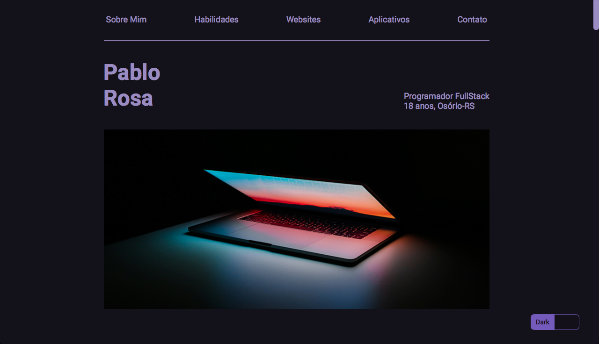
   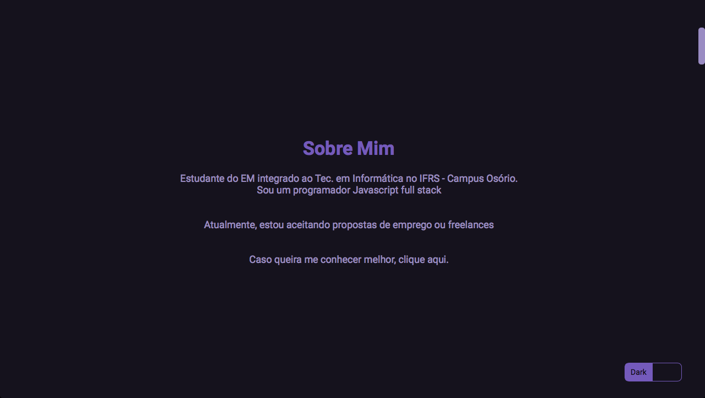
   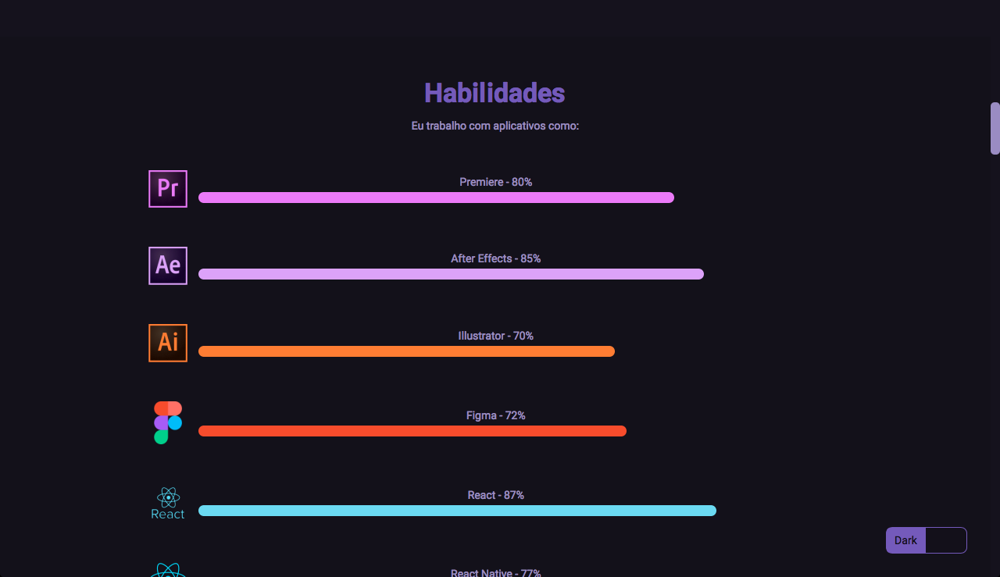
   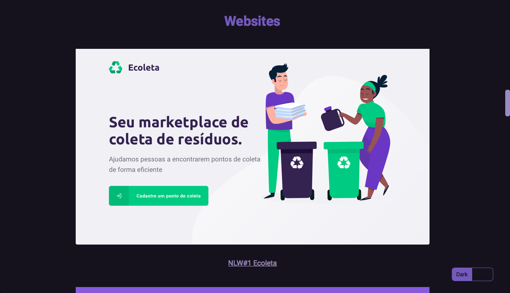
   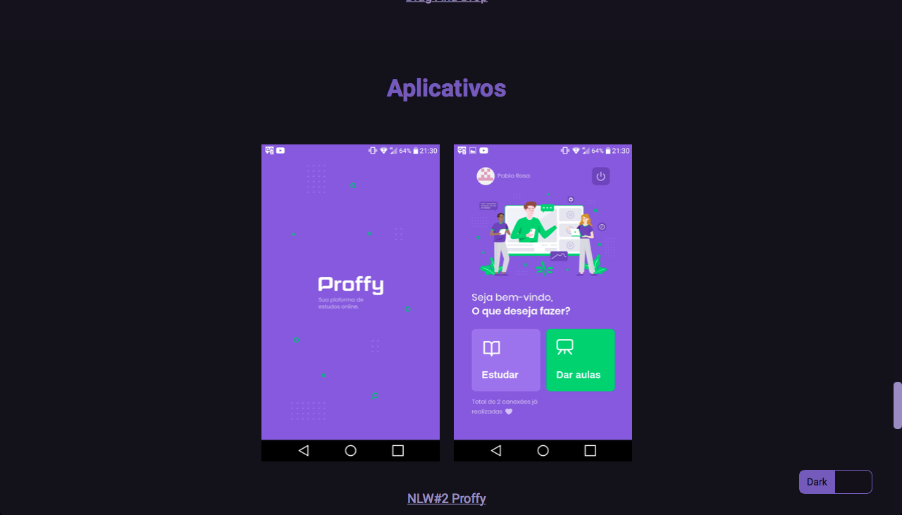
   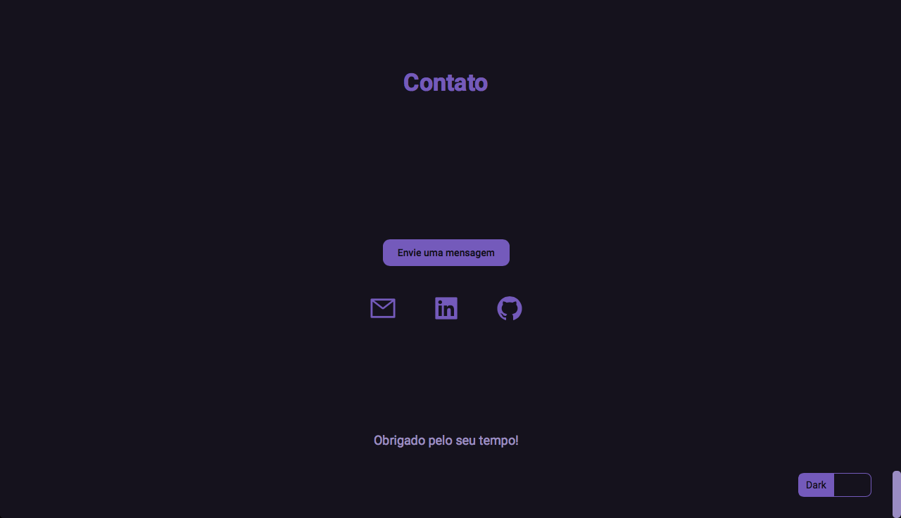
   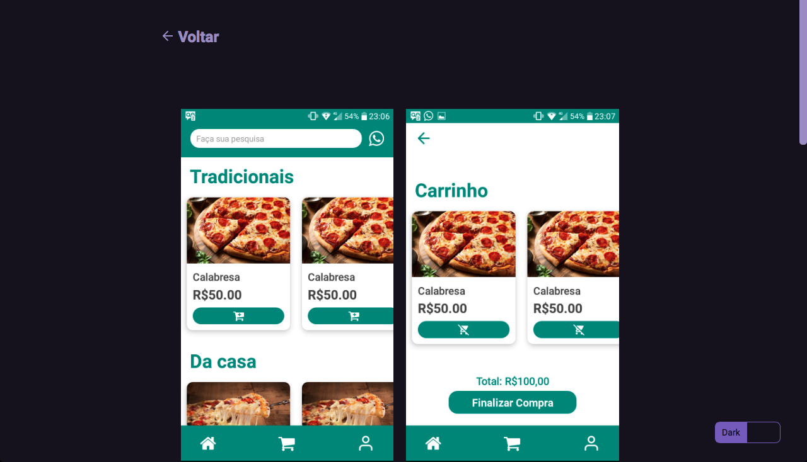
</div>

---

### Tema Light


<div>
   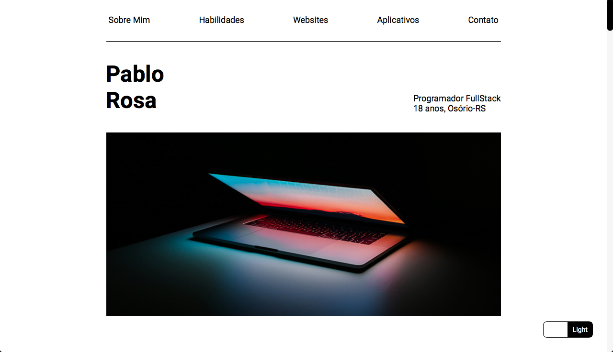
   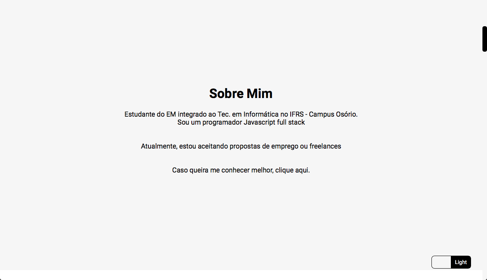
   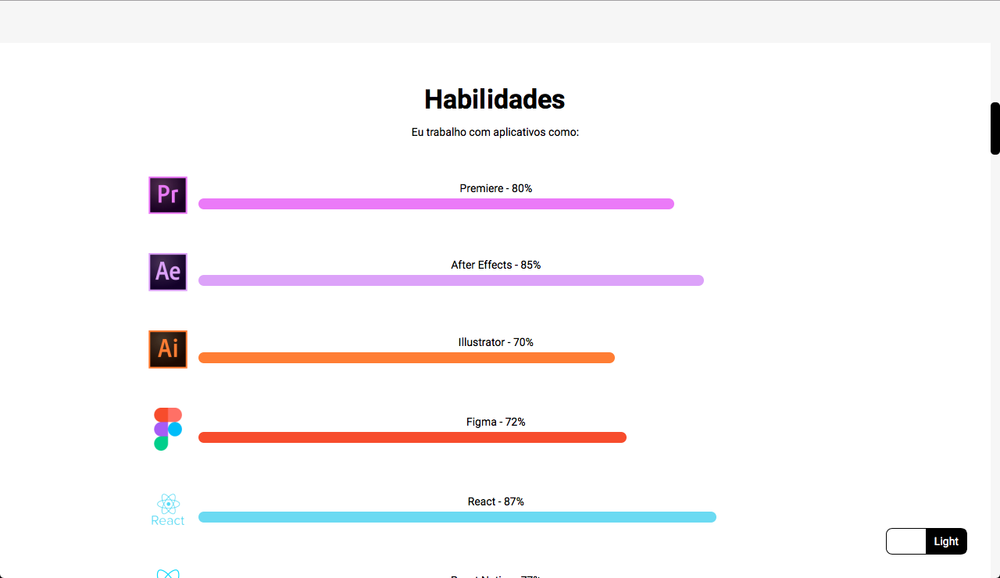
   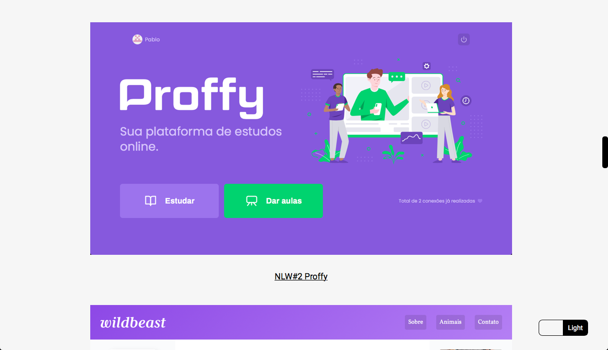
   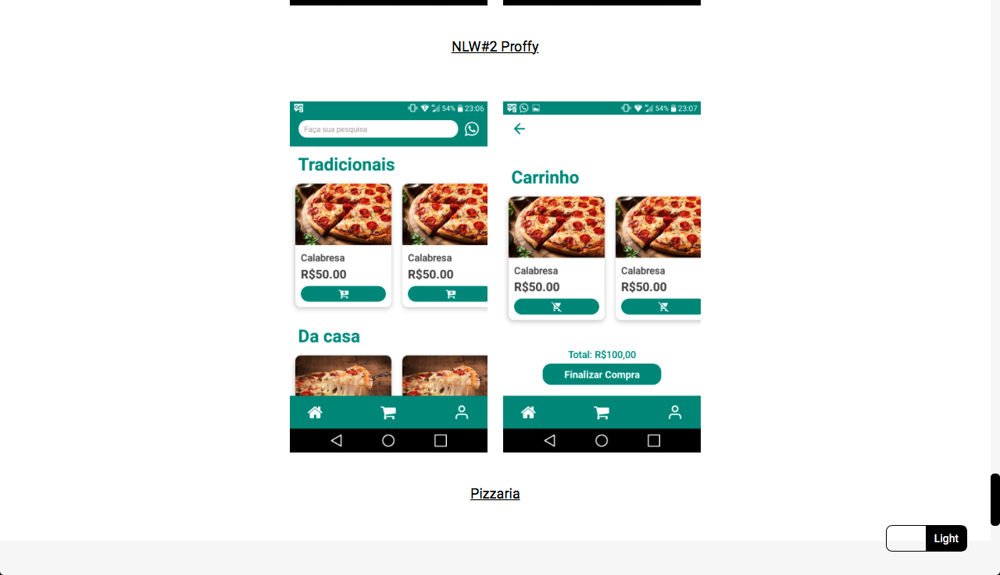
   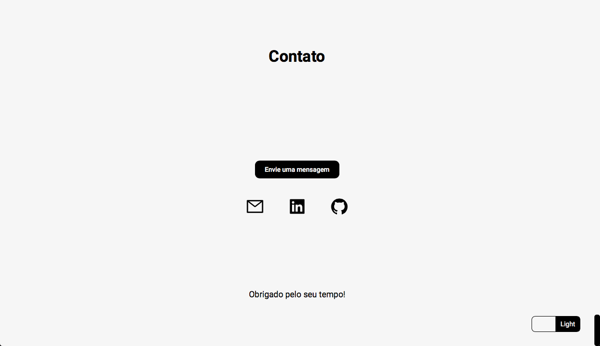
</div>

   

<a id="como-usar"></a>

# :construction_worker: Como usar
  ### **Pré-requisitos**

  - É **necessário** possuir o **[Node.js](https://nodejs.org/en/)** instalado na máquina
  - Também, é **preciso** ter um gerenciador de pacotes seja o **[NPM](https://www.npmjs.com/)** ou **[Yarn](https://yarnpkg.com/)**.

```bash
# Clone o repositório
$ git clone https://github.com/PabloRSantos/Portfolio.git
```

### 💻 Execute o projeto web

```bash
# Entre na pasta web
$ cd Portfolio

# Instale as depêndencias
$ yarn install ou npm install

# Execute a aplicação
$ yarn start ou npm start
```
Vá para http://localhost:3000/ para ver o resultado.

<a id="como-contribuir"></a>

## :tada: Como contribuir

- Faça um Fork desse repositório
- Crie uma branch com a sua feature: `git checkout -b my-feature`
- Commit suas mudanças: `git commit -m 'feat: My new feature'`
- Push a sua branch: `git push origin my-feature`

---

<h4 align="center">
    Feito com 💜 by <a href="https://www.linkedin.com/in/pablo-rosa-68136a1b2/" target="_blank">Pablo Rosa</a>
</h4>
